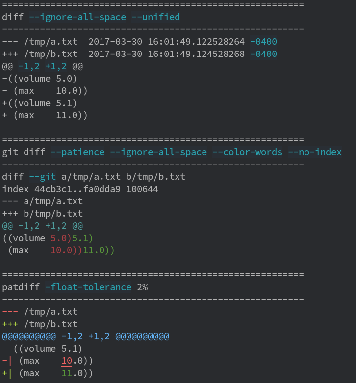
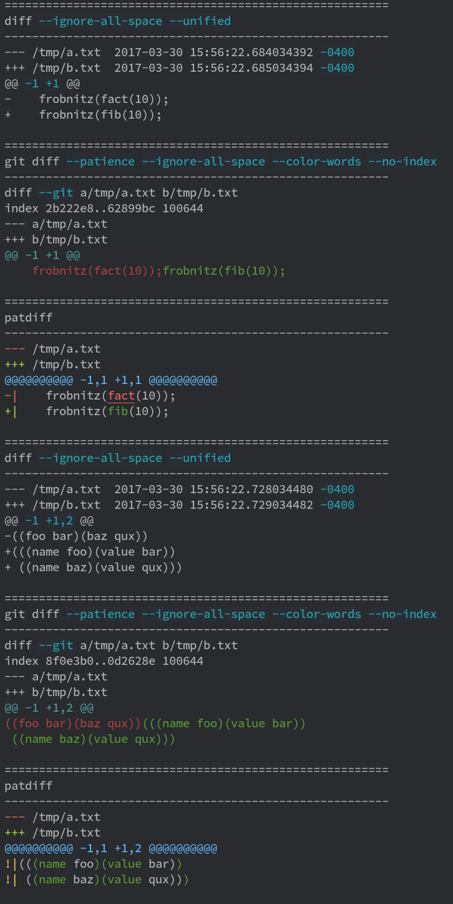

Patdiff - colored patience diffs with word-level refinement
===========================================================

Patdiff is an OCaml implementation of Bram Cohen's patience diff algorithm,
with a few extra conveniences for comparing code and config files:

**outputs plain ASCII, ANSI color codes, or HTML**

**optional semantic diffing of numbers**

**good word-level diffing out of the box**

And of course all the usual features:

- recursive diffing of directories
- extensively configurable output (markers, colors, location format, context)
- whitespace-aware diffing
